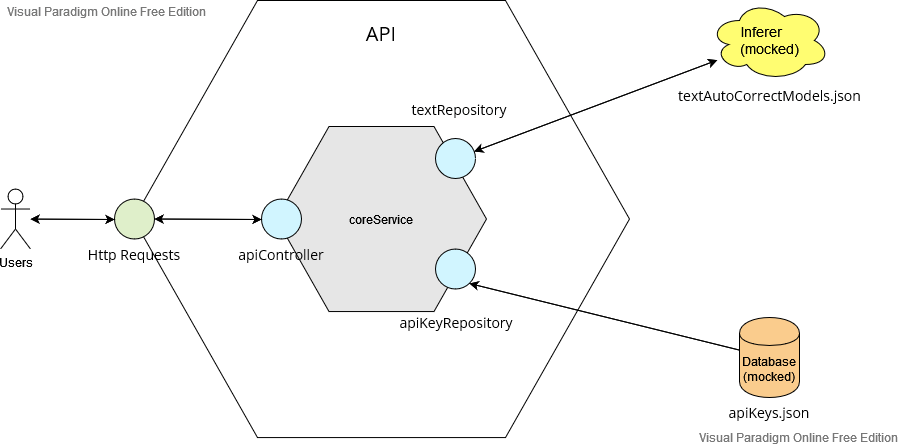

# Gladia.io technical test

This project is my answer to the technical test of [gladia.io](https://gladia.io/)

[here are the instructions](https://gladia.notion.site/senior-fullstack-developer-5bdb09c5ed474c008608bbee0175533f)

The subject is huge and I didn't had time to fullfill it. 

It is composed of 2 projects:
* API
* UI (didn't had time 🙁)

## Prerequisites
* NodeJS + npm -> [install](https://docs.npmjs.com/downloading-and-installing-node-js-and-npm)

## Run
> npm start

## Hexagonal Architecture

## Sources (not ordered)
https://blog.logrocket.com/build-rest-api-typescript-using-native-modules/

https://blog.logrocket.com/express-middleware-a-complete-guide/

https://amirmustafaofficial.medium.com/node-js-and-express-js-with-typescript-d4ea7e61096

https://medium.com/geekculture/how-to-build-a-rest-api-with-express-js-and-typescript-part-ii-organising-routes-ee293eeb16eb

https://wanago.io/2018/12/03/typescript-express-tutorial-routing-controllers-middleware/